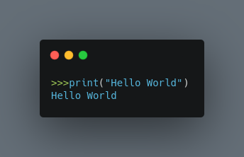

### Day 1 of 100 Days of Python
 

#### What we are building today

 

 

 

#### Things to dive deep into :-

- Printing in Python - Printing is by far the most simplest of statements in python. We have to use a simple print statement to print out whatever we want, like in the image given below :-  
  

